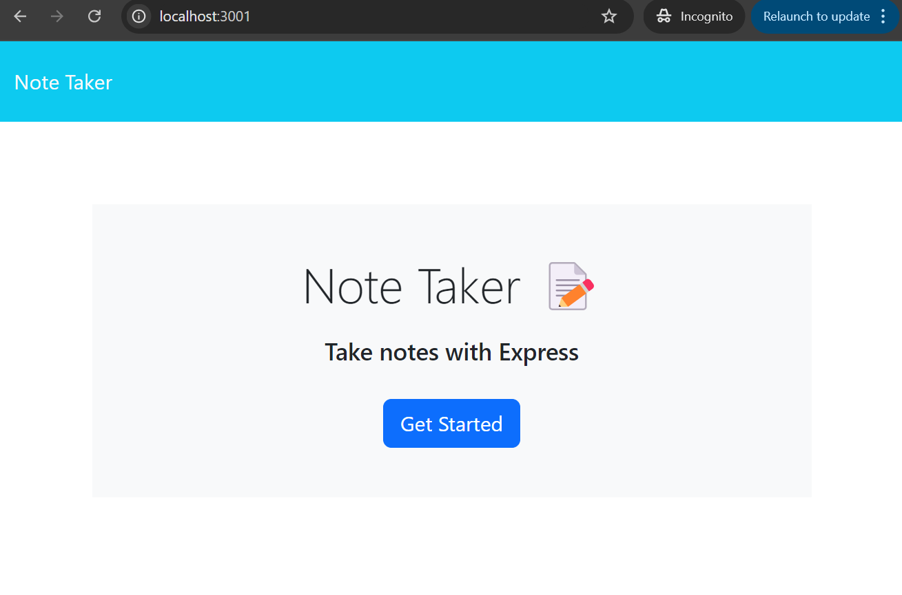
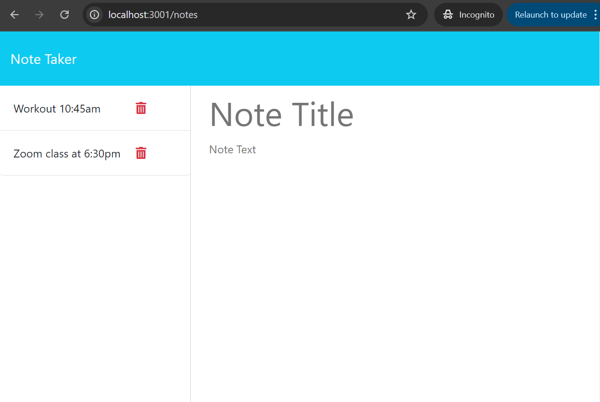
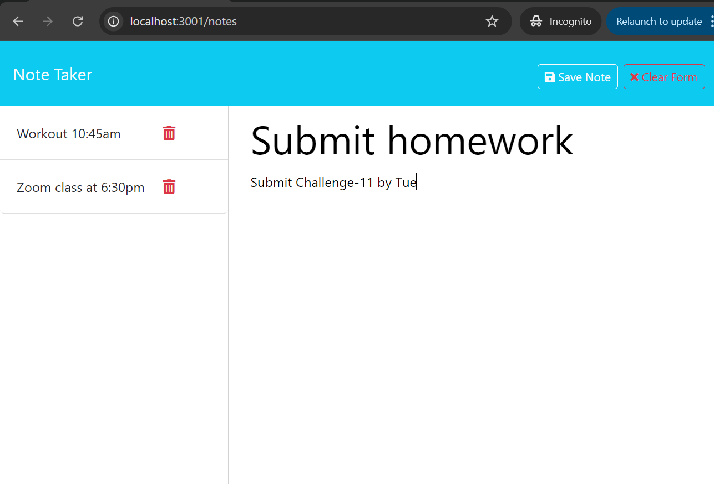
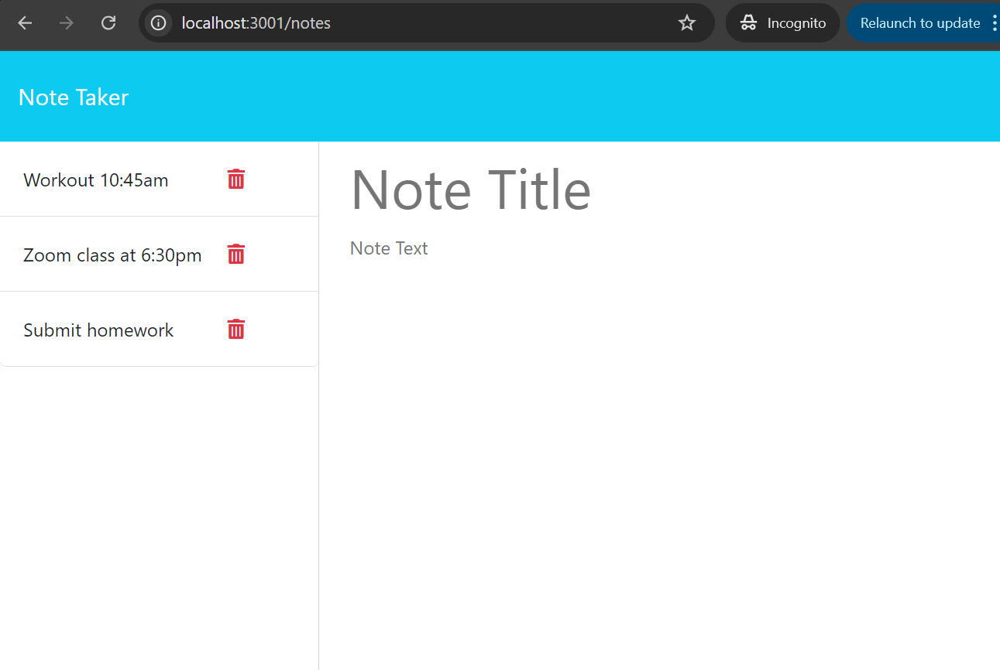
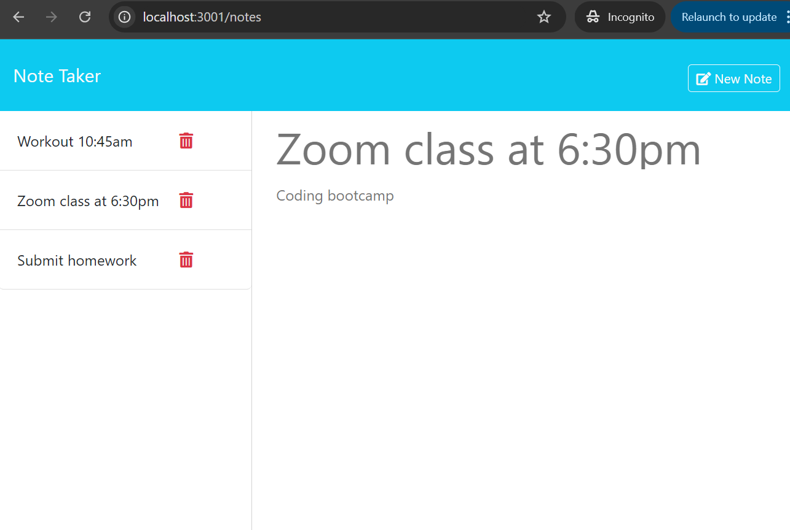
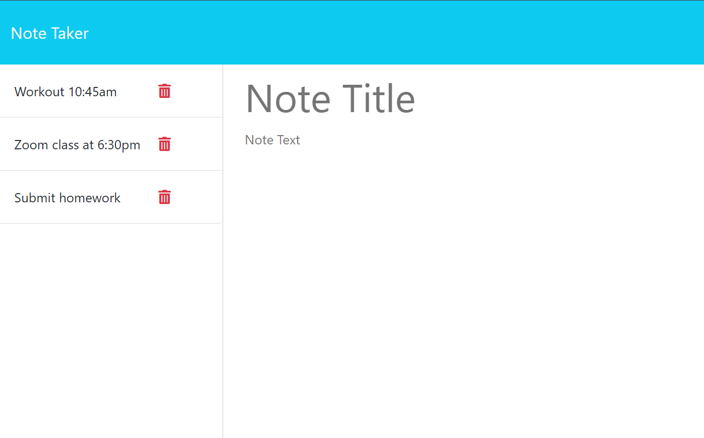
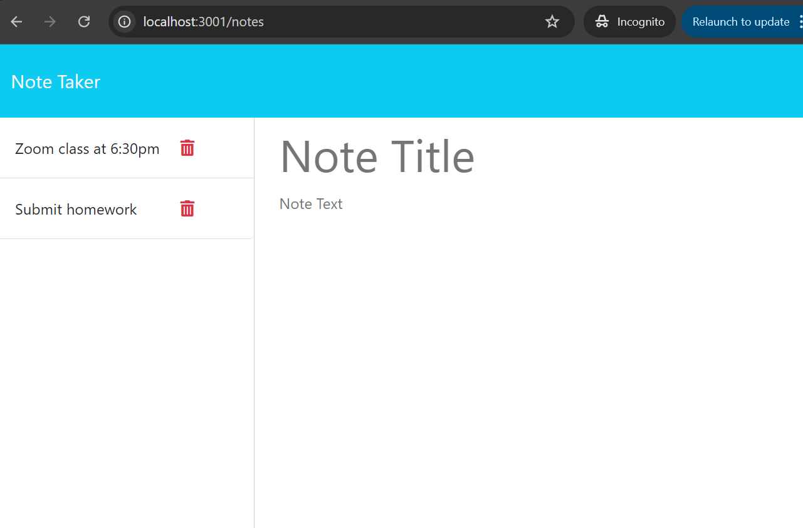

# Note Taker

## Description
In this challenge, I built an application called Note Taker that can be used to write, save and delete notes. This application will use an Express.js back end and will save and retrieve note data from a JSON file.

## Table of Contents
* [Installation](#installation)
* [Usage](#usage)
* [Review](#review)
* [Contact](#contact)

## Installation
Clone this project repository to your computer. Use the terminal to run the commands:
- Use the command "npm install" to install application dependecies. 

## Usage
Navigate to the project folder in the terminal. 
Invoke the application by typing "node index.js" in the terminal's command line. 
Refer to the demonstration video posted in the [Review](#review).

### Screenshots
- A landing page with a link to a notes page

- A notes page with existing notes listed in the left-hand column, and empty fields to enter a new note title and the note’s text in the right-hand column.

- When entering a new note title and the note’s text, the "Save Note" and "Clear Form" buttons appear in the navigation at the top of the page. 

- Clicking on the Save button, saves a note in the db.json file and newly added note appears in the left-hand column with the other existing notes, the "Save Note" and "Clear Form" buttons in the navigation disappear.

- Clicking on an existing note in the list in the left-hand column, displays that note in the right-hand column and a "New Note" button appears in the navigation.

- Clicking on the "New Note" button in the navigation at the top of the page, displays empty fields to enter a new note title and the note’s text in the right-hand column and the button disappears.

- Clicking on the Delete button (trash icon), deletes a note in the db.json file and that note disappears in the left-hand column.

## Review
The walkthrough video that demonstrates application functionality: [video](https://drive.google.com/file/d/12sHeWmg6psycQgmYkoDlRiehKfoXoeU1/view)

## Contact
Contact me with any ideas or requests: akravt1274@gmail.com
